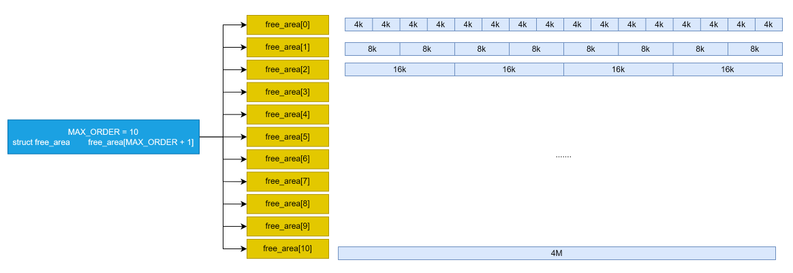
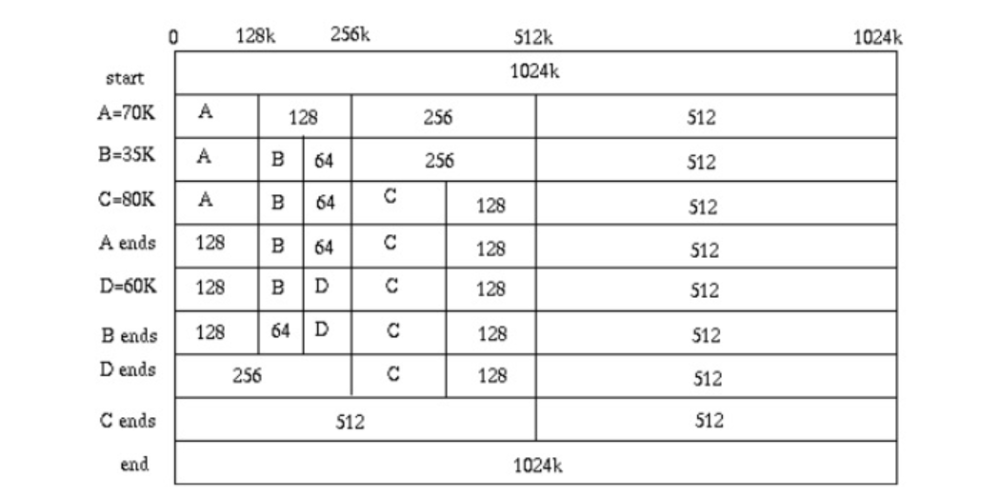

## lab2实验报告

### 练习

对实验报告的要求：
 - 基于markdown格式来完成，以文本方式为主
 - 填写各个基本练习中要求完成的报告内容
 - 完成实验后，请分析ucore_lab中提供的参考答案，并请在实验报告中说明你的实现与参考答案的区别
 - 列出你认为本实验中重要的知识点，以及与对应的OS原理中的知识点，并简要说明你对二者的含义，关系，差异等方面的理解（也可能出现实验中的知识点没有对应的原理知识点）
 - 列出你认为OS原理中很重要，但在实验中没有对应上的知识点

#### 练习0：填写已有实验6

本实验依赖实验1。请把你做的实验1的代码填入本实验中代码中有“LAB1”的注释相应部分并按照实验手册进行进一步的修改。具体来说，就是跟着实验手册的教程一步步做，然后完成教程后继续完成完成exercise部分的剩余练习。

#### 练习1：理解first-fit 连续物理内存分配算法（思考题）

first-fit 连续物理内存分配算法作为物理内存分配一个很基础的方法，需要同学们理解它的实现过程。请大家仔细阅读实验手册的教程并结合`kern/mm/default_pmm.c`中的相关代码，认真分析default_init，default_init_memmap，default_alloc_pages， default_free_pages等相关函数，并描述程序在进行物理内存分配的过程以及各个函数的作用。 请在实验报告中简要说明你的设计实现过程。请回答如下问题：
- 你的first fit算法是否有进一步的改进空间？

答：这里的first-fit就是在整个链表中找第一个能够满足条件的内存块，然后将其分配给调用它的用户。原理在于要分配一定大小的物理内存空间时，查找可用于分配的连续虚拟地址空间，当找到第一个能够容纳待分配的物理内存空间的连续虚拟地址空间时，无论其大小，就将其占用，然后对相应的内存空间大小进行缩减。

default_init函数：其实就是创建一个空链表，并将内部存储的页数置为零，表示内部还没有任何的页。

default_init_memmap函数：这个函数其实实现的是对于一些内存页交由物理内存管理器来管理，这里的base是一个页指针，所以这里首先将这个页数组的所有页表示为保留的，然后更新引用为0，因为这里的内存管理不一定是一个空的链表，所以这里将其按照内存地址进行排序，将这个base插入物理内存管理器中。

default_alloc_pages函数：这个函数实现了分配内存页的方法，首先找到这里的第一个比需要内存页数大的内存块，然后就是将其返回前的操作了，由于这里没有必要全部分配出去，所以当过大时，会分配需要的前n页，将剩下的再去串回pmm中，然后修改可用内存等。

default_free_pages函数：这个函数实现的是对于内存块的回收，回收时首先清空信息，并保证这里处在分配状态，然后将首页设置大小，再将其串回pmm中，但这里实现了对于连续内存地址的合并操作，将链表内连续的内存空间转换成一个较大的块，从而减少内存碎片。

这种分配方法还是存在较多问题的，如很可能会将一块很大的内存切分成很多小内存块，然后当需要大内存时，将会无法分配；且很容易产生很多内存碎片。

相对于best fit连续物理内存分配算法，它的缺点在于无法选择最合适的连续地址空间进行分配，这样就可能导致当较大的连续地址空间在查找链表前端时，就会不断被较小的待分配物理内存占满，此时出现进程需求较大的空间时，就没有足够大的连续地址空间可供使用。

在具体的first fit算法实现中，在初始化一段连续的地址空间时，要按照首页地址的大小将其插入到链表的对应位置，这样就会出现一个时间复杂度的问题。因为插入的过程需要从头部一个一个往后进行比较。
(COMMENT：我觉得这里使用已经到了O(n)，在接受范围内了，优化算法的时候如果进一步复杂化数据结构可能会不利于操作系统的稳定性。)

在具体改进方面，如果只针对这一过程进行优化，可以采用折中等方式找到合适的插入位置，从而减小时间复杂度。而由于页面管理采用多级页表的形式，这是就会出现由若干页组成的大页。我们在实现时也可以借助这样的形式，在链表根据大页中的首地址进行分段，当我们插入新可分配空间时，可以根据其首页地址确定其在哪一个大页中，从而确定其在链表中的位置区域，这样就避免了每次都要从头开始查找的情况。
(COMMENT：但这样的话，内核空间占用会大，而且在如此底层的部分感觉针对这种方法的优化可能会得不偿失，不如思考更好地选择算法了)

#### 练习2：实现 Best-Fit 连续物理内存分配算法（需要编程）
在完成练习一后，参考kern/mm/default_pmm.c对First Fit算法的实现，编程实现Best Fit页面分配算法，算法的时空复杂度不做要求，能通过测试即可。
请在实验报告中简要说明你的设计实现过程，阐述代码是如何对物理内存进行分配和释放，并回答如下问题：
- 你的 Best-Fit 算法是否有进一步的改进空间？

答：这里的Best-Fit算法其实和First-Fit算法原理上相差不大，不过Best-Fit算法会遍历整个链表，然后找到和这里需求的内存大小向上最相近的一个块，然后从中分配出需要的内存，这样可以较好的保存较大的内存块，从而保证需求尽可能被满足。

这里由于best_fit_init和best_fit_init_memmap、best_fit_free_pages的实现和first_fit完全相同，这里不再赘述了，主要在于对页的分配策略，这里在实现时对于整个链表进行遍历，同时源码中给出了min_size定义为整个链表总页数+1,这样便于我们处理这里的更新最小页，当这里遍历到的页满足大于n并且小于当前的最小页min_size时，就会更新我们的page和min_size，那么等到整个链表遍历完成后，就可以得到最后最合适的内存块，这里的时间复杂度为O(n)。

这里的best_fit算法还是存在内存碎片的问题，当分配合适内存后，剩下的块有更大可能会很小，导致出现很多的内存碎片。而且一般情况下这种分配最后的基本很难直接合并。

在具体实现时，我们在每次查找可分配空间时，都会对其进行一次完整的遍历，并从中选择符合best fit要求的可分配连续空间。这样的缺陷就显而易见，有不小的时间复杂度。

```C++
struct Page *page = NULL;
list_entry_t *le = &free_list;
size_t min_size = nr_free + 1;
/*LAB2 EXERCISE 2: YOUR CODE*/ 
// 下面的代码是first-fit的部分代码，请修改下面的代码改为best-fit
// 遍历空闲链表，查找满足需求的空闲页框
// 如果找到满足需求的页面，记录该页面以及当前找到的最小连续空闲页框数量
while ((le = list_next(le)) != &free_list) {
    struct Page *p = le2page(le, page_link);
    if (p->property >= n) {
        if(p->property < min_size)
        {
            min_size = p->property;
            page = p;
        }
    }
}
```
针对这一缺陷，在具体实现best fit算法时，可以再构造一个数据结构对可分配的连续虚拟地址空间根据空间大小（连续物理页的大小）进行从小到大的排序，而不像原来的free_list中用地址的大小进行排序。这样在分配物理内存空间时，就可以从小的可分配空间开始查找，直到找到一个最小的可容纳的可分配空间。这其实是一种实现排序再查找的由空间换时间的算法改进方法。(COMMENT：这里我有一些异议在于这里似乎并不是空间换时间，对于不同大小的插入还是需要时间代价的，并且没有多少的时间优化，感觉不能算空间换时间，且效果不好。)

(COMMENT：这里我有一些别的想法，不是简单的空间换时间的方法，这里联想到了数据库中的对于堆表存储方法的介绍，这里可以实现一个数组，分别表示1、2、4、8、16、32、64、128......、更大的页数的内存，分别存储这些free_list的首地址，然后这里虽然是按照二次幂存储的，但可以不像buddy_system那样强制的要求，而是在每个数组链表这样存储：arr[1]即2页，表示大于2小于4的内存页，然后解释下更大的页数，也就是设定一个大小，对于大于该大小的所有大页都链在那里，然后根据需求的内存大小，去对应的数组元素的链表中查询，这样的映射函数也是很好实现的，同时也减少了时间代价，更重要的是，这里的数组可以人为设定，不需要实现malloc等动态内存分配的情况就可以实现，较为简单。此外，这里的空间代价并不高，只需要增加一个数组就可以了)
#### 扩展练习Challenge：buddy system（伙伴系统）分配算法（需要编程）

Buddy System算法把系统中的可用存储空间划分为存储块(Block)来进行管理, 每个存储块的大小必须是2的n次幂(Pow(2, n)), 即1, 2, 4, 8, 16, 32, 64, 128...

 -  参考[伙伴分配器的一个极简实现](http://coolshell.cn/articles/10427.html)， 在ucore中实现buddy system分配算法，要求有比较充分的测试用例说明实现的正确性，需要有设计文档。

**数据结构设计：**

buddy system（伙伴系统）分配算法将2的n次幂的物理页组合起来，互为伙伴，我们将一组组合起来的物理页的总页数称为块的阶数。在这里我们宏定义一个最大阶数，即组合起来的物理页页数不能超过2的最大阶数次幂，在具体实现时我们设为10，即1024个页。这样，在分配物理内存空间时，确定了所需的物理页数，就需要在free_list中快速找到相应阶数的存储块首页地址，在这种情况下，好的方法就是将一个混杂的free_list分为多个不同阶数对应的free_list，每个free_list只存储相同阶数的存储块。

这样我们就在程序中删去了原有的数据结构free_area，定义了适用于该算法的新数据结构：
```C++
typedef struct {
    unsigned int max_order;
    list_entry_t free_list[MAX_ORDER + 1];         // the list header
    unsigned int nr_free;                          // number of free pages in this free list
} free_buddy_t;
```
其中，max_order记录的是当前所有可分配存储块中最大的存储块对应阶数，这样当需要分配的物理内存空间大于该阶数对应的空间时，就可以提前知道，不需要去查找。free_list数据的下标对应的就是阶数，每个链表只存储对应阶数的存储块首页地址。nr_free依然记录所有可分配存储块的物理页数。


为了适应该系统中的相关参量，我们对Page类中的相关变量的含义进行调整。
```C++
struct Page {
    int ref;                        // page frame's reference counter
    uint64_t flags;                 // array of flags that describe the status of the page frame
    unsigned int property;          // the num of free block
    list_entry_t page_link;         // free list link
};
```
property变量在此系统中记录了该page如果为存储块的首页时该存储块的阶数。

**前期准备：**

在分配内存时，可以要求分配任意页数的内存，但是存储块只有2的n次幂的大小，因此就需要对输入的页数参数进行向上取2的幂次方数。如需分配的页数为17，即使距离2的4次方16就差一页，但是仍然需要分配32页的存储块。

针对此写个向上取2的幂次方数的函数，返回的就是对应存储块的阶数。
```C++
size_t RoundUpOfPower2(size_t x)
{
    size_t i;
    for(i = 0; i < sizeof(size_t) * 8 - 1; i++)
        if((1 << (i + 1)) >= x)
            break;
    return (i + 1);
}
```
**内存初始化：**

内存初始化就是对存储块中的物理页进行操作，更新其中的相应参数，并将首页放入对应阶数的链表中，来标识该存储块的相应物理页可以用于分配物理内存。

模块的输入就是可用于分配的连续虚拟地址空间的首页指针以及可连续分配的物理页数。但是不同于之前的算法，我们不能直接将这些页包装成一个存储块，而是需要包装成多个2的n次幂页数的存储块。比如说有25个连续的页，就需要分成16 + 8 + 1三个存储块进行存储，并将它们分别放入对应阶数的链表中。
```C++
static void
buddy_init_memmap(struct Page *base, size_t n) {
    assert(n > 0);
    cprintf("%d\n", n);
    while(n != 0)
    {
        size_t buddy_size = (size_t)(RoundDownOfPower2(n));
        if(buddy_size > MAX_ORDER)
            buddy_size = MAX_ORDER;
        size_t page_count = 1 << buddy_size;
        struct Page *p = base;
        for (; p != base + page_count; p++) 
        {
            assert(PageReserved(p));
            p->flags = p->property = 0;
            set_page_ref(p, 0);
        }
        base->property = buddy_size;
        SetPageProperty(base);
        nr_free += page_count;
        if (list_empty(&free_list[buddy_size]))     
            list_add(&free_list[buddy_size], &(base->page_link)); 
        else 
        {
            list_entry_t* le = &free_list[buddy_size];
            while ((le = list_next(le)) != &free_list[buddy_size]) {
                struct Page* page = le2page(le, page_link);
                if (base < page) {
                    list_add_before(le, &(base->page_link));
                    break;
                } else if (list_next(le) == &free_list[buddy_size]) {
                    list_add(le, &(base->page_link));
                }
            }
        }
        base = base + page_count;
        n = n - page_count;
        if(buddy_size > max_order)
            max_order = buddy_size;
    }
}
```
需要注意的点是由于我们设置了最大阶数，因此当取的2的次方幂数大于最大阶数时，只能分为多个最大阶数的存储块进行存储。

例如，在具体实验中，我们得知ucore总共有31929页可以分配，此时在内存初始化时，最大只能出现1024页的存储块，就分为了31个阶数为10的存储块，剩余为128 + 32 + 16 + 8  + 1的存储块，共36个存储块。

我们在测试样例中，也测试了这31939页的存储块初始化，并跟踪了相应阶数链表是否为空。根据理论情况，阶数为10、7、5、4、3和0的链表不为空。
```C++
for(size_t i = 0;i <= MAX_ORDER;i++)
{
    le = &free_list[i];
    while ((le = list_next(le)) != &free_list[i]) {
        struct Page *p = le2page(le, page_link);
        assert(PageProperty(p));
        count ++, total += (1 << p->property);
    }
}
assert(total == nr_free_pages());
assert(!list_empty(&free_list[10]));
assert(!list_empty(&free_list[7]));
assert(!list_empty(&free_list[5]));
assert(!list_empty(&free_list[4]));
assert(!list_empty(&free_list[3]));
assert(!list_empty(&free_list[0]));
```
**分配内存：**

内存分配在上文提及，输入待分配的页数需要进行向上取2的次方幂数，再分配对应阶数的存储块。

在确定了需要分配的存储块阶数后，会出现三种情况：

- 对应阶数的链表不为空，说明有相应的存储块，那就直接分配给链表中第一个存储块，把该存储块从链表中删去。
- 对应阶数的链表为空，说明没有相应的存储块，且要求存储块已经是或者大于最大的存储块，没有足够的连续空间来分配给物理内存。
- 对应阶数的链表为空，但是存储块阶数小于目前拥有最大的存储块阶数，这时就需要完成几个步骤。首先是找到一个最小的上阶存储块，接着对这一存储块进行分裂，这一分裂是需要循环进行的，因为上阶存储块不一定是上一阶，必须将其分裂到能容纳待分配空间的最小存储块，因此可能出现多次分裂的过程。最后就是将分裂得到的一个满足要求的存储块进行分配。

```C++
static struct Page *
buddy_alloc_pages(size_t n) {
    assert(n > 0);
    if (n > nr_free)
        return NULL;
    size_t buddy_size = (size_t)(RoundUpOfPower2(n));
    size_t page_count = 1 << buddy_size;
    if(buddy_size > max_order)
        return NULL;
    struct Page *page = NULL;
    list_entry_t *le = &free_list[buddy_size];
    while ((le = list_next(le)) != &free_list[buddy_size]) {
        struct Page *p = le2page(le, page_link);
        page = p;
        break;
    }
    if (page != NULL) {
        list_del(&(page->page_link));
        nr_free -= page_count;
        ClearPageProperty(page);
    }
    else
    {
        size_t ready_buddy_size = buddy_size;
        size_t ready_page_count = page_count;
        while ((le = list_next(le)) == &free_list[ready_buddy_size]) {
            ready_buddy_size = ready_buddy_size + 1;
            ready_page_count = ready_page_count * 2;
            le = &free_list[ready_buddy_size];
        }
        struct Page *base1 = le2page(le, page_link);
        while(ready_buddy_size != buddy_size){
            list_del(&(base1->page_link));
            ready_buddy_size = ready_buddy_size - 1;
            ready_page_count = ready_page_count / 2;
            base1->property = ready_buddy_size;
            struct Page *base2 = base1 + ready_page_count;
            base2->property = ready_buddy_size;
            SetPageProperty(base2);

            if (list_empty(&free_list[ready_buddy_size]))     
                list_add(&free_list[ready_buddy_size], &(base1->page_link)); 
            else 
            {
                list_entry_t* le1 = &free_list[ready_buddy_size];
                while ((le1 = list_next(le1)) != &free_list[ready_buddy_size]) {
                    struct Page* page = le2page(le1, page_link);
                    if (base1 < page) {
                        list_add_before(le1, &(base1->page_link));
                        break;
                    } else if (list_next(le1) == &free_list[ready_buddy_size]) {
                        list_add(le1, &(base1->page_link));
                    }
                }
            }
            list_entry_t* le1 = &free_list[ready_buddy_size];
            while ((le1 = list_next(le1)) != &free_list[ready_buddy_size]) {
                struct Page* page = le2page(le1, page_link);
                if (base2 < page) {
                    list_add_before(le1, &(base2->page_link));
                    break;
                } else if (list_next(le1) == &free_list[ready_buddy_size]) {
                    list_add(le1, &(base2->page_link));
                }
            }
        }
        page = base1;
        list_del(&(page->page_link));
        nr_free -= page_count;
        ClearPageProperty(page);
    }
    return page;
}
```
在测试样例中，我们承接上面的内存初始化结果，即31个10阶存储块，7、5、4、3、0阶各一个存储块。

此时先分配5页内存，此时需要一个3阶存储块，所以测试3阶链表是否变为空，接着再分配5页内存，此时没有3阶存储块，需要4阶存储块分裂为2个3阶存储块，这样4阶链表为空，同时3阶链表不为空。
```C++
struct Page *p0 = alloc_pages(5), *p1, *p2;
assert(list_empty(&free_list[3]));
p1= alloc_pages(5);
assert(list_empty(&free_list[4]));
assert(!list_empty(&free_list[3]));
assert(p0 != NULL);
assert(!PageProperty(p0));
```
**释放内存：**

释放内存涉及存储块的合并，这和之前的算法不同的是，本系统的合并是一个递归的过程，比如释放内存后出现连续地址的8，4，4，16页存储块，两个4页存储块先合并为8页，然后和前面的8页存储块合并为16页，再与后面的16页存储块进行合并，最终组成32页5阶存储块。

针对这样一个递归过程，我们需要设计一个存储块合并的递归函数。
```C++
void buddy_merge(struct Page *base) {
    list_entry_t* le = list_prev(&(base->page_link));
    if (le != &free_list[base->property]) {
        struct Page *p = le2page(le, page_link);
        if (p + (1 << p->property) == base) {
            list_del(&(base->page_link));
            list_del(&(p->page_link));
            ClearPageProperty(base);
            p->property *= 2;
            size_t buddy_size = p->property;
            if (list_empty(&free_list[buddy_size])) 
                list_add(&free_list[buddy_size], &(p->page_link));
            else 
            {
                list_entry_t* le = &free_list[buddy_size];
                while ((le = list_next(le)) != &free_list[buddy_size]) 
                {
                    struct Page* page = le2page(le, page_link);
                    if (p < page) 
                    {
                        list_add_before(le, &(p->page_link));
                        break;
                    } else if (list_next(le) == &free_list[buddy_size]) 
                    {
                        list_add(le, &(p->page_link));
                    }
                }
            }
            buddy_merge(p);
        }
    }

    le = list_next(&(base->page_link));
    if (le != &free_list[base->property]) {
        struct Page *p = le2page(le, page_link);
        if (base + (1 << base->property) == p) {
            list_del(&(base->page_link));
            list_del(&(p->page_link));
            ClearPageProperty(p);
            base->property *= 2;
            size_t buddy_size = base->property;
            if (list_empty(&free_list[buddy_size])) 
                list_add(&free_list[buddy_size], &(base->page_link));
            else {
                list_entry_t* le = &free_list[buddy_size];
                while ((le = list_next(le)) != &free_list[buddy_size]) 
                {
                    struct Page* page = le2page(le, page_link);
                    if (base < page) 
                    {
                        list_add_before(le, &(base->page_link));
                        break;
                    } else if (list_next(le) == &free_list[buddy_size]) 
                    {
                        list_add(le, &(base->page_link));
                    }
                }
            }
            buddy_merge(base);
        }
    }
}
```
一旦发生了合并过程，就需要再进入函数中，寻找前后是否有可以合并的存储块。

之后就只需要考虑不发生合并情况下的释放内存。
```C++
static void
buddy_free_pages(struct Page *base, size_t n) {
    assert(n > 0);
    size_t buddy_size = (size_t)(RoundUpOfPower2(n));
    size_t page_count = 1 << buddy_size;
    struct Page *p = base;
    for (; p != base + page_count; p++) {
        assert(!PageReserved(p) && !PageProperty(p));
        p->flags = 0;
        set_page_ref(p, 0);
    }
    base->property = buddy_size;
    SetPageProperty(base);
    nr_free += page_count;
    if (list_empty(&free_list[buddy_size])) {
        list_add(&free_list[buddy_size], &(base->page_link));
    } else {
        list_entry_t* le = &free_list[buddy_size];
        while ((le = list_next(le)) != &free_list[buddy_size]) {
            struct Page* page = le2page(le, page_link);
            if (base < page) {
                list_add_before(le, &(base->page_link));
                break;
            } else if (list_next(le) == &free_list[buddy_size]) {
                list_add(le, &(base->page_link));
            }
        }
    }
    buddy_merge(base);
}
```
测试样例中，我们先把剩余的可分配页数设为0，此时存储空间只有已分配的两个3阶存储块，此时要分配任何页数都不可能。释放两个3阶存储块，3阶链表不空，但是地址空间不连续，不会发生合并。

此后分配3页，一个3阶存储块分裂为两个2阶存储块，紧接着释放，2阶链表变为空，因为此时发生了合并，3阶链表不为空。
```C++
nr_free = 0;
assert(alloc_pages(4) == NULL);
free_pages(p0, 5);
assert(!list_empty(&free_list[3]));
free_pages(p1, 5);
assert((p2 = alloc_pages(3)) != NULL);
assert(!list_empty(&free_list[2]));
free_pages(p2, 3);
assert(list_empty(&free_list[2]));
assert(!list_empty(&free_list[3]));
nr_free = nr_free_store;
```
(COMMENT:我尝试根据网站上的代码进行一些二叉树形式的尝试，原算法不好移植的点在于使用了动态内存分配来处理这里的结构体空间分配，而这里的操作系统不可能使用库函数来实现这个动态分配，仔细分析在于这里的动态分配是为了便于适应不同内存大小的设定，如果想要强行根据这个来实现，其实只需要根据OpenSBI提供的内存大小来进行预先的分配就可以了，但这样显然并不合适，于是我考虑使用链表来进行这个数组的处理，然后根据这里的链表分配策略来处理内存空间分配，但这时对于内存空间的分配又会出现管理上的问题，比如我分配了4页，这种连续情况下，需要重新设计页，否则会导致应用可以使用该基址后的所有内存，这样会有很大的风险，受时间限制没有继续实现，采取了小组另一位同学的代码，具体实现如上，代码在分支to_the_moon中)

#### 扩展练习Challenge：任意大小的内存单元slub分配算法（需要编程）

slub算法，实现两层架构的高效内存单元分配，第一层是基于页大小的内存分配，第二层是在第一层基础上实现基于任意大小的内存分配。可简化实现，能够体现其主体思想即可。

 - 参考[linux的slub分配算法/](http://www.ibm.com/developerworks/cn/linux/l-cn-slub/)，在ucore中实现slub分配算法。要求有比较充分的测试用例说明实现的正确性，需要有设计文档。

答：

这个挑战没能完成代码，但还是想简单陈述下思路，以供记录:

这里需要实现的是一个对于页的更细粒度的内存分配，其实本质上和页的分配没有本质区别，因为毕竟最终还是有最小的内存分配单元的，这里可以设计一个新的结构体Sturct slab(参考linux的命名)，然后将一个页分成一定的slabs，将一个页使用这种方式来进行存储，然后对于这个slab，可以考虑对其这样处理，开始时为一页，然后分配页后需要对其进行进一步分配时，重新串上剩余的内存大小，然后回收时需要先将slabs进行回收和合并，然后得到整块的页，直到一张页的所有内存全部被回收，这时才能将这个页回收到内存。

此外还需要修改内部的代码，因为目前的框架都是对于页为最细粒度的分配，所以需要在页内在创建一个分配器，由其管理页内的分配，然后提供一些接口供分配内存，这时对于外部程序来说，需要多大内存时，操作系统会将该页的某个slab提供给需要者。

但是问题在于这样不好做不同进程间的隔离，不能确保一个进程不能访问到别的进程，那么就出现了最大的挑战：怎么保证一个页的slab不被分配给不同的进程，可以使用进程号来进行处理，将进程号存储在页中，相同的进程可以分配更细粒度的slab，不同的不能分配，但这时没法做到及时回收slab，并会产生更多的内存碎片，且受到时间的限制，这里很遗憾没能成功完成代码。

#### 扩展练习Challenge：硬件的可用物理内存范围的获取方法（思考题）

- 如果 OS 无法提前知道当前硬件的可用物理内存范围，请问你有何办法让 OS 获取可用物理内存范围？

答：

BIOS/UEFI 访问：
操作系统在启动时可以通过 BIOS 或 UEFI 固件接口获取内存信息。这些固件在启动时会提供内存映射表（如 E820 内存映射），其中详细列出了可用和保留的物理内存范围。

在 BIOS 中，可以使用中断调用来获取内存信息，通常使用的是 INT 0x15 中断。
具体步骤：

    调用 BIOS 中断：
        通过设置寄存器并调用 INT 0x15 来请求内存信息。常用的子功能包括：
            AX = 0xE820: 获取扩展内存信息，包括总内存和可用内存区域。
    寄存器设置：
        设置 EAX 为相应的值（例如，0xE820），然后调用 INT 0x15，返回的信息会存放在 ESI 和 EDX 寄存器中。

UEFI 提供了更现代和灵活的方式来获取系统硬件信息，包括内存。
具体步骤：

    使用 UEFI 协议：
        UEFI 通过定义各种协议来提供硬件信息。获取内存信息通常使用 EFI_MEMORY_DESCRIPTOR 结构。
    通过 GetMemoryMap 函数：
        在 UEFI 环境中，可以调用 GetMemoryMap 函数来获取系统的内存地图，包括可用内存和保留内存。
这里可以在初始化内存的汇编代码中，通过这些操作确定内存地址，然后根据不同的计算机来进行不同的映射，从而得到更好的移植性。

设备树（Device Tree）：
设备树主要能够先于操作系统加载，由固件(BIOS、UEFI)提供，固件初始化并通过bootloader将其加载到内存中，同时被编译成二进制格式(Device Tree Blob, DTB)，便于直接读取，且加载时非常高效，此外作为硬件抽象层的一部分，硬件发生变化不需要像硬解码一样修改操作系统的内核代码，而是只需要更新设备树即可。

操作系统通过读取设备树，就可以得到相应的物理空间，然后就可以通过读取的物理内存大小来进行内核的映射，这样就不需要修改操作系统的代码也可以广泛的应用于不同硬件的电脑上。
