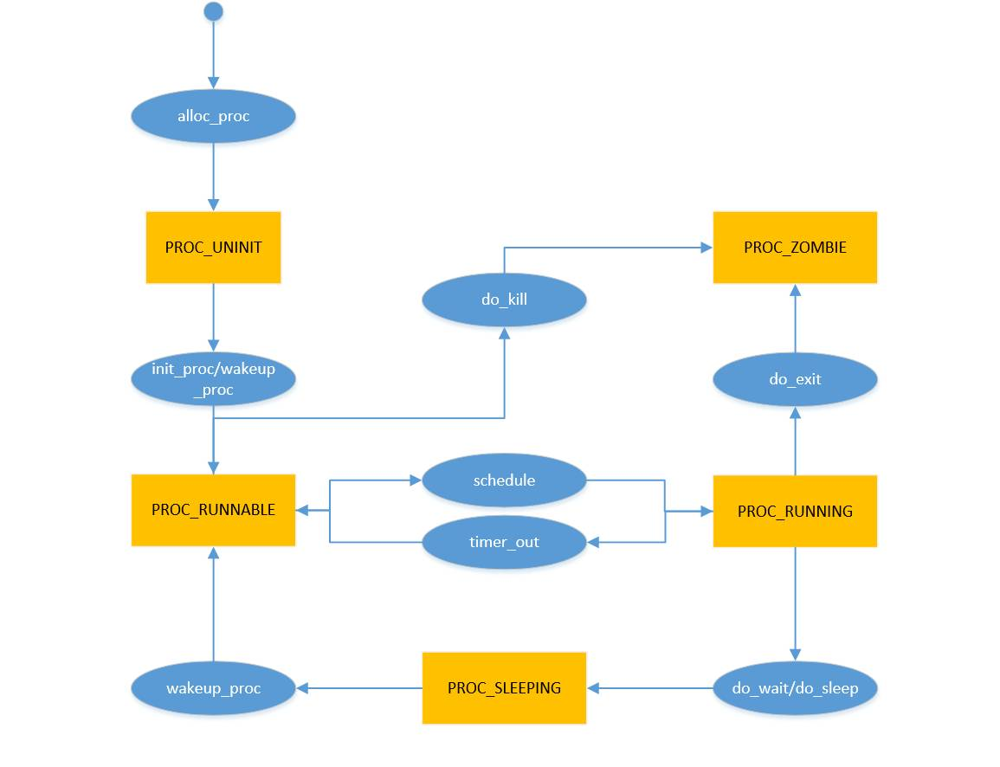
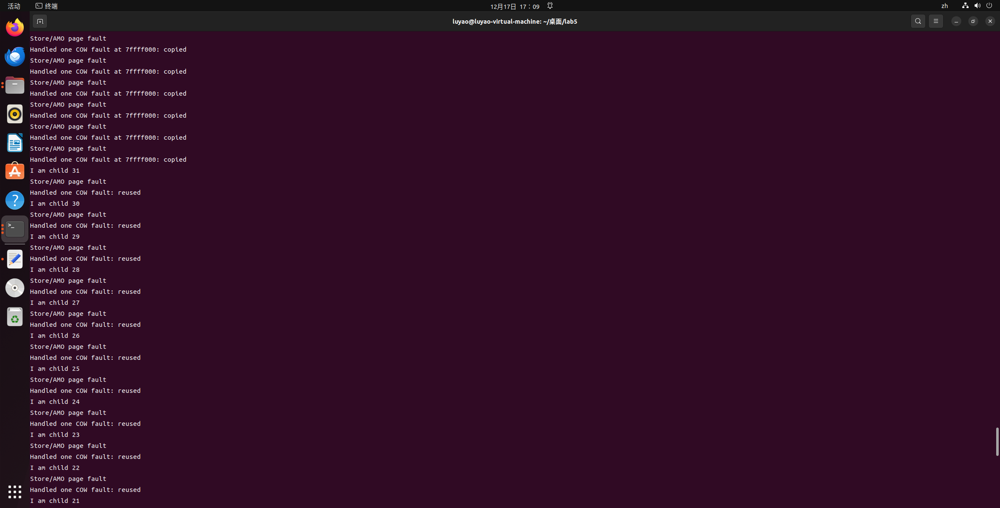

# lab5:用户程序

## 练习1: 加载应用程序并执行（需要编码）

> do_execv函数调用load_icode（位于kern/process/proc.c中）来加载并解析一个处于内存中的ELF执行文件格式的应用程序。你需要补充load_icode的第6步，建立相应的用户内存空间来放置应用程序的代码段、数据段等，且要设置好proc_struct结构中的成员变量trapframe中的内容，确保在执行此进程后，能够从应用程序设定的起始执行地址开始执行。需设置正确的trapframe内容。
>
> 请在实验报告中简要说明你的设计实现过程。
>
> 请简要描述这个用户态进程被ucore选择占用CPU执行（RUNNING态）到具体执行应用程序第一条指令的整个经过。

### 设计实现过程

load_icode函数完成了从一个内存中ELF可执行文件加载并解析应用程序的过程，其工作包括为current创建新的内存管理结构，将ELF文件按段加载到内存中，为用户堆栈分配内存，设置用户态的 trapframe等等。

在其中，我们要做的工作就是设置trapframe中的几个关键寄存器。其中gpr.sp表示用户栈顶，因此我们设置为USTACKTOP；epc表示从内核态返回时返回的位置，由于此处为初始化，从内核态返回即为从用户态开始执行，因此设置为用户态程序的入口，即先前解析出的elf->e_entry；status是状态寄存器，其中标志位SSTATUS_SPP表示先前此程序是否处于特权态，从而在中断返回时对应地设置寄存器，SSTATUS_SPIE表示先前此程序是否开启中断，由于我们要返回用户态，因此通过&~SSTATUS_SPP将这一标志位置为0，表示为用户态，通过| SSTATUS_SPIE打开中断，而其他与sstatus相同，为进入用户态做准备。

具体的编码内容如下：
```c
tf->gpr.sp=USTACKTOP;
tf->epc = elf->e_entry;
tf->status = (sstatus & ~SSTATUS_SPP) | SSTATUS_SPIE;
```
### 从选中到具体执行第一条指令的经过

在init_main中，执行了int pid = kernel_thread(user_main, NULL, 0);，其中为传入的user_main创建了对应的内核进程，之后在子进程退出前schedule();，我们假设此时子进程user_main被选中执行。

user_main事实上调用了KERNEL_EXECVE或KERNEL_EXECVE2，其事实上都是根据传入的名字选择对应的执行程序，并调用函数kernel_execve。

在函数kernel_execve中，为了实现内核态进行syscall，其通过ebreak触发中断加对应中断函数调用syscall的方法，事实上调用了SYS_exec函数，而在此函数中又调用了do_execve。

在do_execve中，经历一系列检查后，调用我们先前编写的load_icode，加载了要加载的程序并对应地修改了其中断帧。接下来在这一系列函数返回，我们进行中断恢复时，会调用kernel_execve_ret，而后__trapret，最后 sret，由于我们前面load_icode修改了trapframe，将epc修改为用户态程序的入口，状态修改为用户态，故而控制流会转向用户程序以用户态开始执行用户程序。

## 练习2: 父进程复制自己的内存空间给子进程

> 创建子进程的函数do_fork在执行中将拷贝当前进程（即父进程）的用户内存地址空间中的合法内容到新进程中（子进程），完成内存资源的复制。具体是通过copy_range函数（位于kern/mm/pmm.c中）实现的，请补充copy_range的实现，确保能够正确执行。
> 
> 请在实验报告中简要说明你的设计实现过程。
> 
> 如何设计实现Copy on Write机制？给出概要设计，鼓励给出详细设计。

### 设计实现过程
copy_range应用于do_fork-->copy_mm-->dup_mmap-->copy_range，其函数原型为`int copy_range(pde_t *to, pde_t *from, uintptr_t start, uintptr_t end,bool share)`。此函数的作用为在启用虚拟页表的情况下由用户虚拟地址进行内存的复制。

其实现逻辑为循环地遍历从start到end的from虚拟地址页，在循环内部，首先获取根据from页表获取虚拟地址对应的pte，并获取对应物理页；接下来获取to页表的对应pte，如对应的pte不存在，则使用get_pte创建一个，并为to页表的pte alloc_page对应的物理页。

接下来是实际的页面复制工作，即我们编码的部分。页面的复制要使用memcpy函数，此函数需要传入内核虚拟地址，因此需要先使用page2kva获取对应的内核虚拟地址，并在复制完成之后使用page_insert将复制后的页实际维护到to进程的页表中，具体的编程内容如下所示。
```c
//(1) find src_kvaddr: the kernel virtual address of page
void* src_kvaddr = page2kva(page);
//(2) find dst_kvaddr: the kernel virtual address of npage
void *dst_kvaddr = page2kva(npage);
//(3) memory copy from src_kvaddr to dst_kvaddr, size is PGSIZE
memcpy(dst_kvaddr, src_kvaddr, PGSIZE);
//(4) build the map of phy addr of  nage with the linear addr start
ret = page_insert(to, npage, start, perm);
```
### Copy on Write机制

Copy-on-write（简称COW）的基本概念是指如果有多个使用者对一个资源进行读操作，则每个使用者只需获得一个指向同一个资源的指针。若某使用者需要对这个资源进行写操作，系统会对该资源进行拷贝操作，从而使得该“写操作”使用者获得一个该资源的私有拷贝，而对这个私有拷贝进行写操作。

在UCore操作系统中，我们给出此机制的一个简要实现设计如下：

在原本的代码框架中，dum_mmap函数调用了copy_range函数，而在调用前，存在share控制信号，就是为了控制是否存在Copy on Write机制中的共享资源，因为这里就可以利用share控制信号，来在已有框架下修改copy_range函数。

原本的copy_range函数中，当不同进程想要使用相同的物理内存空间时，就会将相同的那部分物理内存空间（start到end）以物理页为单位复制一份出去，两个进程就可以分别使用各自的物理内存空间。而如果启用了Copy on Write机制，就会让两个进程的相应页表项同时指向同一个物理页，这样就不需要再单独开块内存来进行复制，起到了节省内存空间的效果。但是这样之后相关物理页就要设为只读的状态。

之后尝试对共享的物理页进行写操作时，由于共享状态的物理页是只读的，因此就会触发中断，这样我们就需要在相应的page fault处理函数那里对写操作按照Copy on Write机制进行处理。根据机制，需要对物理页进行私有拷贝，然后让当前进程单独获取该拷贝资源，进行相应的写操作。

在这个过程中，需要判断page fault是否是因为COW机制造成的，这里具体的解决方案为：首先先判断是否是因为物理页的只读权限造成的page fault，再通过vma_struct的相关记录（因为之前只修改页表项，没有修改vma_struct）判断是COW机制还是普通的只读权限造成的异常。

当然还有一种办法就是为页表项再单独设立一个标志位，来标识COW机制造成的共享状态，但是这要对页的访问等机制都进行修改，因此这里没有实现。

## 练习3: 阅读分析源代码，理解进程执行 fork/exec/wait/exit 的实现，以及系统调用的实现

> 请在实验报告中简要说明你对 fork/exec/wait/exit函数的分析。并回答如下问题：
> 
> 请分析fork/exec/wait/exit的执行流程。重点关注哪些操作是在用户态完成，哪些是在内核态完成？内核态与用户态程序是如何交错执行的？内核态执行结果是如何返回给用户程序的？
> 请给出ucore中一个用户态进程的执行状态生命周期图（包执行状态，执行状态之间的变换关系，以及产生变换的事件或函数调用）。（字符方式画即可）

### 对 fork/exec/wait/exit函数的分析

首先总体介绍这四个函数被调用的过程，从initproc内核进程创建userproc进程开始，运行user_main()函数，该函数里又执行kernel_execve函数，加载参数代表的用户程序，这里userproc从内核进程转为用户进程，用户程序中可以调用执行fork/exec/wait/exit函数。

这些函数都是对系统调用的封装，调用这些函数时，处于用户态，而真正的执行函数需要在内核态运行，此时通过内联汇编的ecall指令进入内核态，具体原理就是ecall指令触发中断，此时中断处理程序通过scause寄存器里的值，判断出是由ecall造成的中断，从而进行对应的中断处理，也就是进行系统调用，这里就完成了从用户态进入内核态。

内核态中通过调用相应的sys_fork/sys_exec/sys_wait/sys_exit函数，这些函数里又调用相应的do_fork/do_exec/do_wait/do_exit函数完成最后的操作。在其中，通过修改trapframe中指向的变量来实现在用户程序获知内核态的执行结果，即通过trapframe传递信息；或通过ecall的返回结果寄存器直接获取return的内容。

fork 执行完毕后，如果创建新进程成功，则出现两个进程，一个是子进程，一个是父进程。在子进程中，fork 函数返回 0，在父进程中，fork 返回新创建子进程的进程 ID。我们可以通过 fork 返回的值来判断当前进程是子进程还是父进程。fork 不会影晌当前进程的执行状态，但是会将子进程的状态标记为RUNNALB，使得可以在后续的调度中运行起来；

exec 完成用户进程的创建工作。首先为加载新的执行码做好用户态内存空间清空准备。接下来的一步是加载应用程序执行码到当前进程的新创建的用户态虚拟空间中。exec 不会影晌当前进程的执行状态，但是会修改当前进程中执行的程序；

wait 是等待任意子进程的结束通知。wait_pid 函数等待进程 id 号为 pid 的子进程结束通知。这两个函数最终访间 sys_wait 系统调用接口让 ucore 来完成对子进程的最后回收工作。wait 系统调用取决千是否存在可以释放资源（ZOMBIE）的子进程，如果有的话不会发生状态的改变，如果没有的话会将当前进程置为 SLEEPING 态，等待执行了 exit 的子进程将其唤醒；

exit 会把一个退出码 error_code 传递给 ucore，ucore 通过执行内核函数 do_exit 来完成对当前进程的退出处理，主要工作简单地说就是回收当前进程所占的大部分内存资源，并通知父进程完成 最后的回收工作。exit 会将当前进程的状态修改为 ZOMBIE 态，并且会将父进程唤醒（修改为RUNNABLE），然后主动让出 CPU 使用权。



## 扩展练习 Challenge

### 实现 Copy on Write （COW）机制

> 给出实现源码,测试用例和设计报告（包括在cow情况下的各种状态转换（类似有限状态自动机）的说明）。

> 这个扩展练习涉及到本实验和上一个实验“虚拟内存管理”。在ucore操作系统中，当一个用户父进程创建自己的子进程时，父进程会把其申请的用户空间设置为只读，子进程可共享父进程占用的用户内存空间中的页面（这就是一个共享的资源）。当其中任何一个进程修改此用户内存空间中的某页面时，ucore会通过page fault异常获知该操作，并完成拷贝内存页面，使得两个进程都有各自的内存页面。这样一个进程所做的修改不会被另外一个进程可见了。请在ucore中实现这样的COW机制。

> 由于COW实现比较复杂，容易引入bug，请参考 https://dirtycow.ninja/ 看看能否在ucore的COW实现中模拟这个错误和解决方案。需要有解释。

#### 状态转换说明：
状态转换我们以物理页为单位，首先正常来说一个物理页只被一个进程引用，此时如果统一物理页被不同进程所引用，比如运行fork函数时，Copy on Write机制下会默认让两个进程的对应页表项都指向该物理页，而不会将该物理页进行复制，从而节省内存。如果此时只发生读操作，就不会出现异常，而如果此时其中一个进程想要进行写操作时，由于该共享的物理页被设为了只读状态，因此就会触发page fault，在page fault的处理时，就会将该物理页拷贝一份，让两个进程分别享有各自的私有内存资源，然后将物理页设为可读可写状态，这样就能正常进行写操作。

#### 源码
copy_range函数：
```C++
if(share)
{
    page_insert(from,page,start,perm & (~PTE_W));
    page_insert(to,page,start,perm & (~PTE_W));
}
```
以share作为控制信号，将两个进程的页表项都指向同一物理页，并且要更新页表项的权限。

do_pgfault函数：
```C++
if (vma->vm_flags & VM_WRITE) {
	struct Page* p = pte2page(*ptep);
	assert(p != NULL);
	assert(p->ref > 0);
	if (p->ref > 1) {
		struct Page *npage = alloc_page();
		assert(npage != NULL);
		void* src_kvaddr = page2kva(page);
        void *dst_kvaddr = page2kva(npage);
        memcpy(dst_kvaddr, src_kvaddr, PGSIZE);
		page_insert(mm->pgdir, npage, addr, ((*ptep) & PTE_USER) | PTE_W);
	} else {
		page_insert(mm->pgdir, p, addr, ((*ptep) & PTE_USER) | PTE_W);
	}
} 
else 
	goto failed;
```
通过vma_struct的相关记录（因为之前只修改页表项，没有修改vma_struct）判断是COW机制还是普通的只读权限造成的异常，如果是COW机制造成的，就用原来copy_range函数里复制内存的方法，同时主要要更新页表项权限为可读可写，注意这里的更新是副本的更新，原来的page不用更新，因为如果此时有不只两个进程共享资源的话，原物理页的权限依然是只读，因为它还处于COW机制下的共享状态。如果此时物理页只剩下当前进程引用，再把它改为可读可写状态。

#### 测试样例


#### 漏洞分析
Dirty COW漏洞的原理在于有一个统一的对物理页进行访问的函数，函数参数会携带一个FOLL_WRITE标记，用以指明当前操作是写入某个物理页。COW机制下，当携带FOLL_WRITE标记进行写操作时，就会在page fault的处理函数中发生内存复制的操作，这样进程就能有私有的内存块，由于上次写操作没有成功，此时再进行相同的写操作，不过此时FOLL_WRITE标记将会被抹去，这是因为因为COW已经执行完成，对于新的物理页无论是读还是写都没有问题，所以该标记已经失去了作用，可以被抹去。但是如果此时有其他线程运行时，将新创建的物理页直接删除，这样之前更新的页表项就会映射回原来的只读页（这里就对应原来的page不更新读写权限）。之后由于操作不带FOLL_WRITE标记，所以不被认为是写操作，这样就完成了对只读页的修改，出现了权限越界。

要模拟这样的实现，第一个条件就是要模拟相关对物理页的读写访问操作，设置FOLL_WRITE等标志位。具体就是要实现这些操作标志位与页的读写权限之间的对应关系，从而根据某一具体操作的标志位和它要进行访问的物理页权限来决定是否进入page fault中断处理，然后在处理完成后对标志位进行相应的更新，然后进行retry操作。

第二个条件就是要有线程能对复制的内存进行丢弃，并且让页表项映射回原来的物理页。比如Linux中就有madvise()系统调用函数，这个调用通过指定第三个参数为MADV_DONOTNEED告诉内核不再需要声明地址部分的内存，内核将释放该地址的资源，进程的页表会重新指向原始的物理内存。

对于该漏洞的解决方案，可以像练习2中提及的那样，为页单独设立一个COW共享标志位，而不是只读，这样就将普通的只读和COW造成的只读做了区分，在一开始拷贝内存副本时，拷贝出来的副本设为可读可写权限，而原物理页保持COW共享标志位。当遇到不携带FOLL_WRITE标记的写操作，物理页有COW共享标志位，就需要先进行复制内存副本的操作，这样就能避免漏洞。

还有一种方法就是不修改页的权限标志位，而在对统一的对物理页进行访问的函数中，不再把FOLL_WRITE标记去掉，而是添加一个FOLL_COW标志来表示获取一个COW分配的页，这样就因为FOLL_WRITE标志还在，就需要先进行复制内存副本的操作，这样也能避免漏洞。

### 说明该用户程序是何时被预先加载到内存中的？与我们常用操作系统的加载有何区别，原因是什么？

目前我们的用户程序其实是在操作系统编写时就直接写入了，我们可以结合Makefile和grade.sh得知，我们现在的实现其实是在编译时，就直接编码进用户程序``umain``中，并通过内联汇编进行调用，整体得到elf，然后在这里我们就可以重新再使用``loadicode``内存中移动到进程中的空间，这里其实是在加载时通过两个全局变量进行记录，以下引自往年实验指导书，注释Makefile第6行得到的：

	+ cc user/hello.c
	riscv64-unknown-elf-gcc -Iuser/ -mcmodel=medany -O2 -std=gnu99 -Wno-unused -fno-builtin -Wall -nostdinc  -fno-stack-protector -ffunction-sections -fdata-sections -Ilibs/ -Iuser/include/ -Iuser/libs/ -c user/hello.c -o obj/user/hello.o

	riscv64-unknown-elf-ld -m elf64lriscv -nostdlib --gc-sections -T tools/user.ld -o obj/__user_hello.out  obj/user/libs/panic.o obj/user/libs/syscall.o obj/user/libs/ulib.o obj/user/libs/initcode.o obj/user/libs/stdio.o obj/user/libs/umain.o  obj/libs/string.o obj/libs/printfmt.o obj/libs/hash.o obj/libs/rand.o obj/user/hello.o

	+ ld bin/kernel
	riscv64-unknown-elf-ld -m elf64lriscv -nostdlib --gc-sections -T tools/kernel.ld -o bin/kernel  obj/kern/init/entry.o obj/kern/init/init.o obj/kern/libs/stdio.o obj/kern/libs/readline.o obj/kern/debug/panic.o obj/kern/debug/kdebug.o obj/kern/debug/kmonitor.o obj/kern/driver/ide.o obj/kern/driver/clock.o obj/kern/driver/console.o obj/kern/driver/picirq.o obj/kern/driver/intr.o obj/kern/trap/trap.o obj/kern/trap/trapentry.o obj/kern/mm/vmm.o obj/kern/mm/swap.o obj/kern/mm/kmalloc.o obj/kern/mm/swap_fifo.o obj/kern/mm/default_pmm.o obj/kern/mm/pmm.o obj/kern/fs/swapfs.o obj/kern/process/entry.o obj/kern/process/switch.o obj/kern/process/proc.o obj/kern/schedule/sched.o obj/kern/syscall/syscall.o  obj/libs/string.o obj/libs/printfmt.o obj/libs/hash.o obj/libs/rand.o --format=binary  obj/__user_hello.out obj/__user_badarg.out obj/__user_forktree.out obj/__user_faultread.out obj/__user_divzero.out obj/__user_exit.out obj/__user_softint.out obj/__user_waitkill.out obj/__user_spin.out obj/__user_yield.out obj/__user_badsegment.out obj/__user_testbss.out obj/__user_faultreadkernel.out obj/__user_forktest.out obj/__user_pgdir.out --format=default
	riscv64-unknown-elf-objcopy bin/kernel --strip-all -O binary bin/ucore.img
而常规的操作系统应该是在后续操作系统启动后再被启动的，这里其实是因为我们还没有实现文件系统，导致我们无法读取文件，所以只能在操作系统编译时就写入，当我们实现了文件系统后，就可以和常用操作系统以一样进行加载了。


